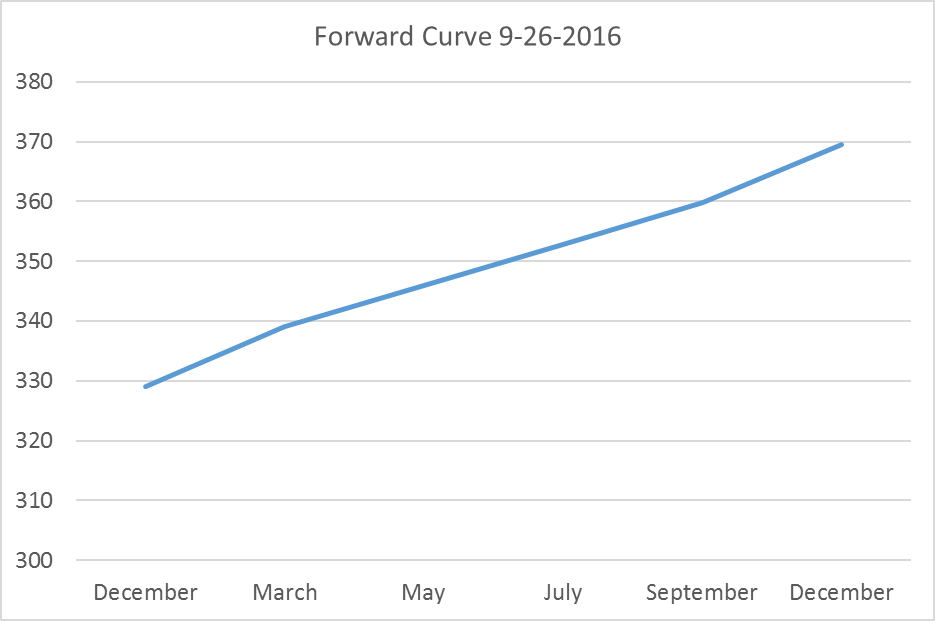
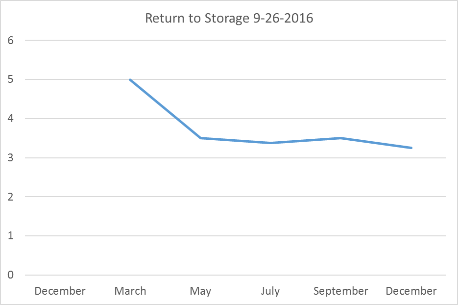
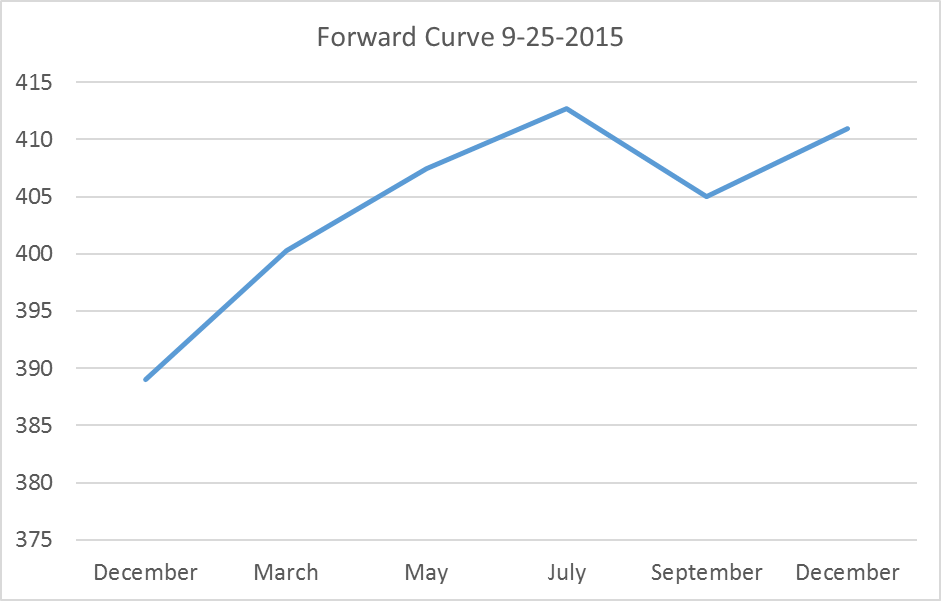
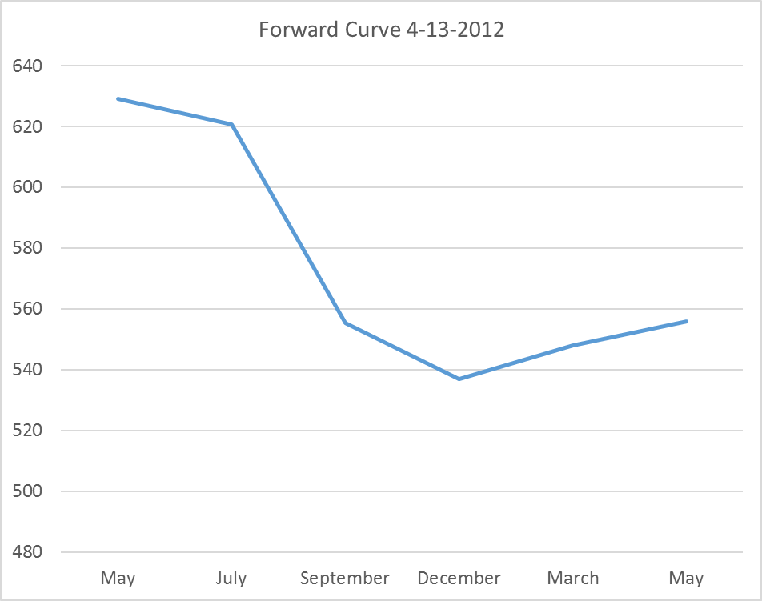
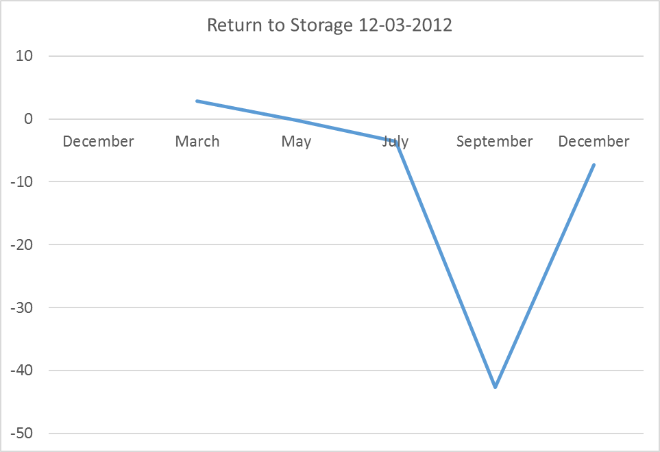
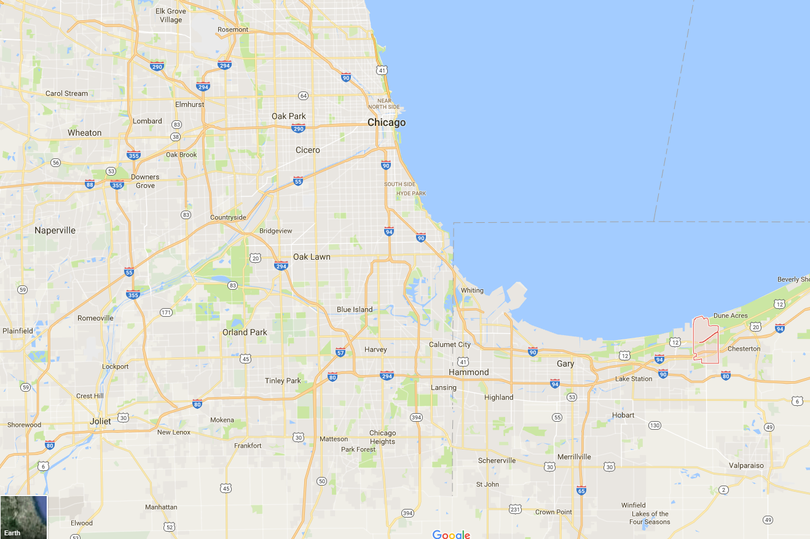
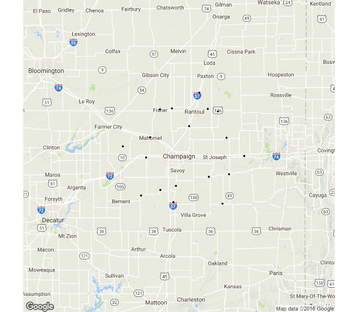

# Prices Over Space and Time

In this section we cover how commodity prices behave over time and space. We have discussed frequently that commodity futures contracts have an expiration, that there are always several contracts trading at any given time with maturities that are increasingly farther into the future, and that these contracts will eventually expire and no longer be traded. 

The exercise from section A1.2 introduced the concept of a 'nearby' series of prices, which is the prices of the contract that is next to expire. We built by hand a nearby price series by downloading futures contract prices from Quandl and putting together the nearby series. 

The rest of the prices make up what is called *The Forward Curve*. The forward curve is simply the prices of the deferred contracts. There is valuable information in the forward curve because it is the market's best guess of what returns to storage will be. 

## An Increasing Forward Curve

Figure 1 illustrates the forward curve on September 26, 2016 in the left panel. 

The reason that the forward curve represents return to storage is that it shows how much extra money can be made by storing to a later date, rather than selling in the cash 'spot' market today. December corn is worth 330 cents per bushel and March corn is worth 340 cents per bushel, then you can make an extra 10 cents per bushel by selling the March futures and selling into the cash market later.  

In figure 2, the returns to storage per month are plotted. For example, the we said that the return to storage between December and March is 10 cents per bushel. Since there are 2 months between December and March, the per month return to storage is $10/2 = 5$ cents per bushel. The market is offering farmers and other holders of stocks 5 cents per month to store grain between December and March.

What kind of market environment would produce such a result? 

When stocks are plentiful the market offers a premium to those who are willing to keep grain off the market for awhile. This prevents prices from plunging too much right after a big harvest, since many choose to wait for better prices later in the marketing year. Also, since these price relationships are 'discovered' and change every day, if it turns out grain is coming onto the market too fast or too slowly, the return to storage changes to alter the incentives so that supply and demand can remain in equilibrium throughout the whole marketing year even though we only harvest once per year (in North America).

This kind of market environment is sometimes called a *carry market* or sometimes it is said that the market is *in full carry*. This means that the market is offering returns to storage that covers the cost to rent warehouse space, insure, and finance storing grain in until a later date. The year of 2016 is certainly a full carry market. Record production and a high forecast of ending stocks make this the classic market environment where returns to storage would be positive. 

As another example, the forward curve and returns to storage are shown for 2015 in figures 3 and 4. 

This example illustrates a phenomenon that often occurs. Here we saw that the forward curve is upward sloped until September. Then it flattens and returns to storage go away. This makes sense because in September we begin to see some of the next year's crop come onto the market. So in 2015, the market was basically asking farmers to keep storing through July, but no longer. Anyone planning to hold grain from July to September and beyond could expect to lose as much as 4 cents per month. 

## A Decreasing Forward Curve

Next we will consider a year that was characterized by a decreasing forward curve. You will recall that 2012 was a significant drought year that resulted in poor yields, high prices, and low forecasted ending stocks for the marketing year. In this kind of market environment, where supplies are tight, the forward curve tends to be downward sloped. The implication of this is that anyone who decides to hold grain will lose money because it is worth more today than it is tomorrow. The market is incentivising everyone to bring grain onto the market.  

We will look at the forward curve and return to storage in steps for 2012. On 4-13-2-12 the forward curve and returns to storage per month are as shown in figure 5 and 6. This is in the spring, before the drought has happened. 

In this case, supplies were already tight going into 2012. The forward curve is downward sloped, also called *inverted* or *backwardated*. So returns to storage are negative, as shown in Figure 6 through the summer of 2012, even before we had the drought realized. However, it is apparent from the forward curve that as of 4-13-2012, the market 'thought' that the 2012 harvest would be good, because price levels drop substantially in the September and December contract, and the return to storage between December 2012 and March 2013 is positive on 4-13-2012. 

Next, lets look at the forward curve and return to storage on 8-01-2012. By August 1, it is clear that we are in the midst of a major drought, yields will be low, and ending stocks for the coming marketing year will be low as well. 

Now, the forward curve is downward sloped and returns to storage are for the entire marketing year until the next harvest, in 2013, is expected. On 4-13-2012, the market was offering about 5 cents per month to store from December 2012 to March 2013, by 8-01-2012, the return to storage between the same time period was about -1 cent.

Now, just to illustrate how the forward curve changed between August and December 2012, the time in which harvest occurred and we learned exactly how bad yields turned out to be, we show the forward curve and returns to storage on 12-03-2012 in figures 9 and 10. 

## Calendar Spreads  

The prior discussion has viewed the forward curve and returns to storage from the perspective of a farmer or other who holds physical stocks of grain. Speculators watch the price spread between futures contracts and trade them to bet on whether or not returns to storage will increase or decrease. These kinds of spreads are called *Calendar Spreads* and they are done by performing the following type of trade. 

### Bullish

Buy: Dec 2016, 
Sell:  March 2017

Then you are betting that prices in general will go up, but the nearby will go up more than the deferred contracts. Any information event that suggests supplies will become tighter should make prices go up in general, and should reduce the incentive to store. Thus, making this a profitable calendar spread trade. 

### Bearish

Sell: Dec 2016,
Buy: March 2017

The opposite logic is at work here. You are betting that prices will go down in general, but that the nearby will go down more than the deferred contracts. Any information that suggests supplies will become more plentiful should make prices go down in general, and should increase incentives to store. Thus making the bearish calendar spread profitable. 

## Price Variation Over Space

Most of our time in this course has focused on what impacts futures prices for commodities. However, a futures price represent the expected future price of the commodity in a very specific location - the locations that are 'regular' for delivery. A location that is regular for delivery is a location that is designated by the commodity exchange where stocks of a commodity represented by a futures contract may be delivered in fulfillment of the contract. This is where the spot, or cash, price must come together, or converge, with the futures price.   

(Source [Google Maps](https://www.google.com/maps))

(Source [Google Maps](https://www.google.com/maps/place/Burns+Harbor,+IN/@41.740398,-87.7248706,10.5z/data=!4m5!3m4!1s0x8811bc3712ab828d:0x98301a46014d10b5!8m2!3d41.6258708!4d-87.1333676))

Since the price of the futures contract is represents the expected future price only at these locations (technically whichever is cheapest to deliver) then the degree to which the futures price is indicative of the expected future spot price at locations far from Northern Illinois can vary. 

Throughout the rural U.S., grain elevators, ethanol plants, soybean crushers, feed yards and biodeisel manufacturers dot the landscape every few miles. These entities buy essentially all of the grain and oilseed crop that is not used on-farm for livestock feeding. They post bids to buy every day they are open. They offer to buy as a cash sale, or on forward contract for delivery one to three months ahead. In the case of the forward contract, the farmer will go in to the elevator and sign a contract to deliver a specific number of bushels within a specified window of time. Usually, the prices quoted by grain elevators and other prices is relative to the futures contract price, or basis. 

In figure 13 the elevators around Champiagn, IL are shown.  

Depending on how far the location is from the Illinois river, this difference may be large, but still the futures price is the reference point. The basis is often quoted as 'over' or 'under' the futures price. For example, an elevator might post bids to buy for $-27$ cents. This means $27$ cents under the futures price. A bid of $31$ would be read as $31$ cents over the futures price.

## Definition of Basis

Basis is always defined as Spot Price minus Futures price.

$$Basis = Spot - Futures$$

Basis reflects the price differential over space relative to the futures price. Basis is influenced by 

+ Transportation Costs
+ Local Supply and Demand Conditions
+ Interest and Storage Charges (this reflects that there is also a small time component as well as spatial)
+ Other Handling, Shipping and other Costs

Transportation costs are built into basis because large users of grain are not necessarily located in large production region. E.g., cattle feed yards in Western Kansas and Nebraska; Chickens in the South; and Hogs in North Carolina. Grain is shipped by rail and/or truck to locations across the country. Areas of grain surplus generally have a negative basis, the spot price is less than the futures. Areas of grain deficit generally have a positive basis, the spot price is greater than the futures. 

Local supply and demand conditions are also important. Occasionally, there will be localized production problems. The biggest recent example comes from the demand side, however. The expansion in ethanol production in the U.S. was felt greatest in Iowa. As literally billions of gallons of capacity in ethanol production came online in Iowa, the corn basis was affected. With additional large consumers of corn located throughout Iowa, there was more localized demand for corn. The ethanol plants and grain elevators had increased localized competition, and local basis bids started to rise between 2005 and 2010. 

## Terminology

Farmers and grain handlers alike watch the basis closely, so discussion of changes in the basis is common. When the basis is increasing, in most cases that means becoming 'less negative', we say the basis is **stregthening**. When the basis is decreasing, or becoming 'more negative', we say the basis is **weakening**. 

