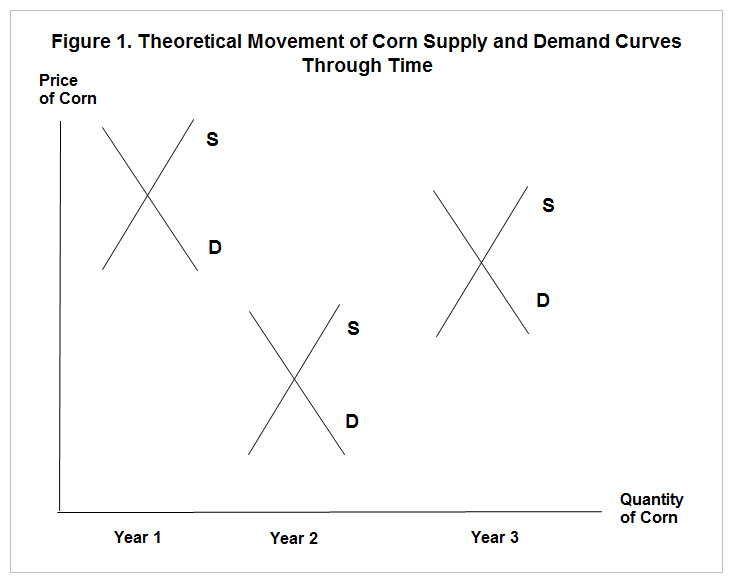
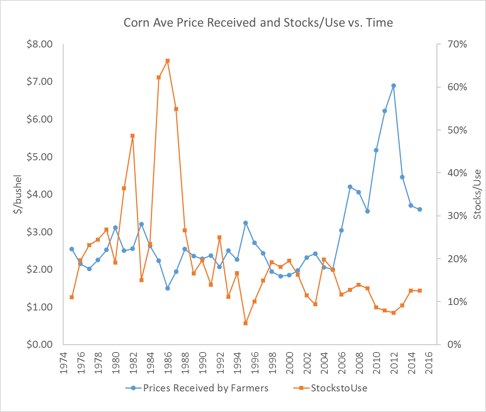
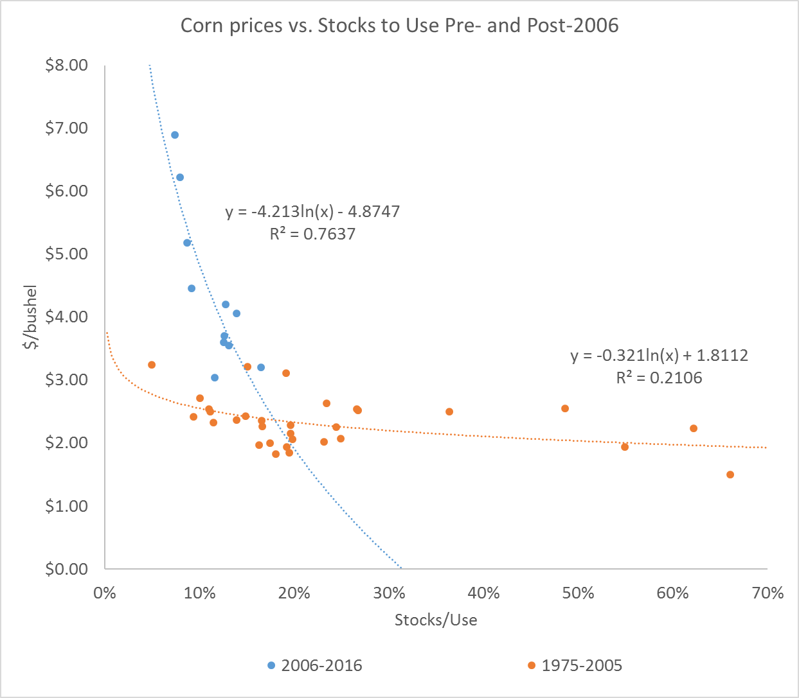

# Ending Stocks and Price 

Over the course of the last several chapters we have covered each category of supply and use. In tables 1 and 2 below, that literally means we covered how to forecast the numbers in each row of the USDA WASDE balance sheet. Subtracting total use from total supply gives an estimate of marketing year ending stocks. For example, in table 1, 

$$Supply, Total - Use, Total = 16,909 - 14,500 = 2,409 (Million bushels) = Ending Stocks;$$ 

in table 2[^adding]

$$Supply, Total - Use, Total = 4,426 - 4,061 = 365 (Million bushels) = Ending Stocks$$

[^adding]: Recall that WASDE balance sheets do not always add perfectly due to rounding.  

: Table 1. September 2016 USDA WASDE Balance Sheet for Corn

Corn                         Marketing Year 2014/2015   Marketing Year 2015/2016 Est.   Marketing Year 2016/2017 July Projection   Marketing Year 2016/2017 August Projection 
---------------------------  -------------------------  ------------------------------  -----------------------------------------  -------------------------------------------
**Million Acres**                                                                                                                                                             
Area Planted                 90.6                       88                              94.1 *                                     94.1                                       
Area Harvested               83.1                       80.7                            86.6 *                                     86.6                                       
**Bushels**                                                                                                                                                                   
Yield per Harvested Acre     171                        168.4                           168.0 *                                    175.1                                      
**Million Bushels**                                                                                                                                                           
Beginning Stocks             1232                       1731                            1701                                       1706                                       
Production                   14216                      13601                           14540                                      15153                                      
Imports                      32                         65                              40                                         50                                         
**Supply, Total**            **15479**                  **15397**                       **16281**                                  **16909**                                  
Feed and Residual            5314                       5200                            5500                                       5675                                       
Food, Seed & Industrial      6567                       6567                            6650                                       6650                                       
*Ethanol & by-products*      *5200*                     *5200*                          *5275*                                     *5275*                                     
Domestic, Total              11881                      11767                           12150                                      12325                                      
Exports                      1867                       1925                            2050                                       2175                                       
**Use, Total**               **13748**                  **13692**                       **14200**                                  **14500**                                  
Ending Stocks                1731                       1706                            2081                                       2409                                       
**Avg. Farm Price ($/bu)**   **3.7**                    **3.55 - 3.65**                 **3.10 - 3.70**                            **2.85 - 3.45**                            

and 

: Table 2. September 2016 USDA WASDE Balance Sheet for Soybeans

Soybeans                     Marketing Year 2014/2015   Marketing Year 2015/2016 Est.   Marketing Year 2016/2017 July Projection   Marketing Year 2016/2017 August Projection 
---------------------------  -------------------------  ------------------------------  -----------------------------------------  -------------------------------------------
**Million Acres**                                                                                                                                                             
Area Planted                 83.3                       82.7                            83.7*                                      83.7                                       
Area Harvested               82.6                       81.8                            83*                                        83                                         
**Bushels**                                                                                                                                                                   
Yield per Harvested Acre     47.5                       48                              48.9*                                      50.6                                       
**Million Bushels**                                                                                                                                                           
Beginning Stocks             92                         191                             255                                        195                                        
Production                   3927                       3929                            4060                                       4201                                       
Imports                      33                         25                              30                                         30                                         
**Supply, Total**            **4052**                   **4145**                        **4346**                                   **4426**                                   
Crushings                    1873                       1900                            1940                                       1950                                       
Exports                      1842                       1880                            1950                                       1985                                       
Seed                         96                         97                              95                                         95                                         
Residual                     50                         12                              31                                         31                                         
**Use, Total**               **3862**                   **3889**                        **4016**                                   **4061**                                   
Ending Stocks                191                        255                             330                                        365                                        
**Avg. Farm Price ($/bu)**   **10.1**                   **8.95**                        **8.35 - 9.85**                            **8.30 - 9.80**                            

However, this still leaves a lot to be desired because the most compelling reason to keep a detailed balance sheet and forecast future supply and use is to come up with a reasonable expectation for price. After all our work on forecasting the components of the balance sheet, we have not made much headway in that regard. In this chapter, we cover some approaches for taking a forecast of ending stocks and translating that into a forecast of price. 

## Forecasting Price

Arriving at an estimate of ending stocks gives one a sense of the degree of scarcity (or lack-thereof) in the market. It is still difficult to infer the marketing year average price from that, because the prevailing price that should coincide with the forecasted ending stocks is a function of the elasticities of demand for different use categories. These can be difficult to estimate, and we are not guaranteed that elasticity is constant from one year to the next. 

Figure 1 below is reproduced from the farmDoc Daily (fdd) article by Good and Irwin, "The Relationship between Stocks-to-Use and Corn Prices Revisited"

Source: [FarmDoc Daily](http://farmdocdaily.illinois.edu/2015/04/relationship-stock-to-use-and-corn-prices.html)

Since the supply curve shifts from year-to-year and the demand curve shifts from year-to-year due to a myriad of factors, one cannot count on estimating a single supply or demand curve from a series of price and quantity pairs. However, once we have entered a marketing year; i.e., we have harvested the domestic supply in the balance sheet, we can count of total supply being quite inelastic. We can be confident of this because imports are historically a very small part of domestic total supply for corn, and after the domestic harvest, imports would be the only way to shift the supply curve. Further, if one had some confidence that the demand curve was more or less constant through time, a time-series of prices and quantities would approximately trace out the demand curve. 

## Examining the Data

This section continues to draw heavily on the Good and Irwin fdd article referenced above. First let us take a look at the average price received for corn over time and the stocks-to-use of corn over time in figure 2. These data can both be obtained from the [USDA ERS Feed Grains Database](http://www.ers.usda.gov/data-products/feed-grains-database.aspx) database, although you have to download the *stocks* and *use* separately and create your own stocks-use-variable. 

Perhaps the first thing that one notices in this figure is the pronounced stocks-to-use spikes that occurred in the 1982/1983 and 1985/1986, 1986/1987, 1987/1988 marketing years. Those exceptionally high stocks relative to use was a result of government commodity programs designed to keep prices from falling too far. Specifically, the stocks were help primarily in the Farmer-Owned-Reserve or by the Commodity Credit Corporation [@westcott1999price]. Both programs were designed to keep bushels off the market and thus buoying prices. During periods of prolonged excesses, however, it becomes very costly for the government to procure and store large quantities of the commodity and it has a continuing depressing effect on market prices because the market knows the government holds large stockpiles. Farm legislation ('The Farm Bill' is re-negotiated every four years by congress) has trended toward more market-oriented approaches to supporting agriculture, and one can observe a marked decline in stocks-to-use over time. 

Aside from the the wild swings in the 1980's, the series still seem to show a negative relationship between stocks-to-use and prices, as one would expect. Figure 3 graphs these two series as a scatter-plot with stocks-to-use on the x-axis. 

A clear negative relationship emerges, but the relationship when stocks are less than 20% of use is less clear. To help clarify, figure 4 highlights years before and after 2006. 

Highlighting the data and pre- or post-2006[^post2006] clearly shows a wide range of prices over a relatively narrow range of stocks-to-use realizations. Given that 2006 is the beginning of the ramp-up in ethanol production, this should not be surprising. Suddenly there was a large and very inelastic demander of corn in the market. This ensured supply would have to be rationed by price to keep stocks from falling to low levels. 

[^post2006]: The year 2006 here is assumed to be a transtion year and dropped from the figure. In 2006, stock-to-use was 11.63% and average price was $3.04. Examining this data-point on Figure 4 suggests 2006 does not fit either regime well. 

Also in figure 4 trendlines are fitted for the two subsets of the data. Since both scatterplots appear to display a curvature, the price data are regressed on the log of the stocks-to-use data. Also, this specification provided the highest $R^2$ of the regression specifications available in the defalt Excel options. The regression in the post-2006 period explains 80% of the variaiton in the price data, which suggests it is a reasonable starting point for forecasting price using ending stocks and the balance sheet approach.   

## References

Good, D., and S. Irwin. "[The Relationship between Stocks-to-Use and Corn Prices Revisited](http://farmdocdaily.illinois.edu/2015/04/relationship-stock-to-use-and-corn-prices.html)." farmdoc daily (5):65, Department of Agricultural and Consumer Economics, University of Illinois at Urbana-Champaign, April 9, 2015.

