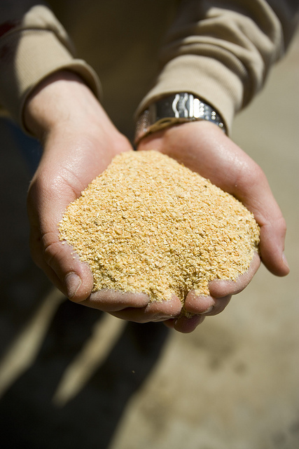
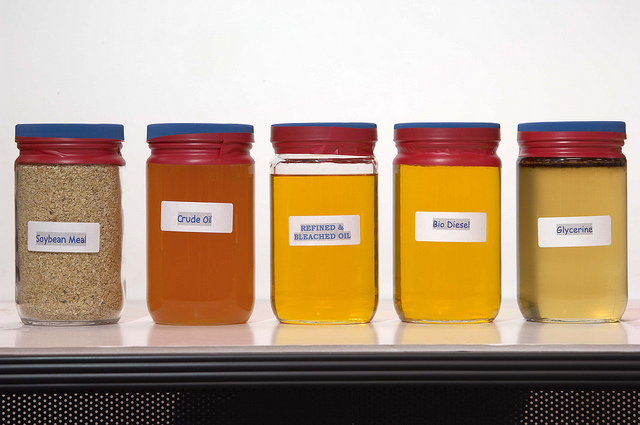
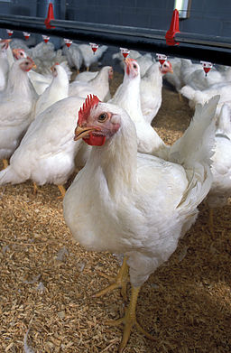

# The Soybean Crush

In this Chapter we describe the physical process of converting soybeans into meal and oil, as well as the price relationship that is maintained between these highly related commodities. We saw in the chapter, 'Forecasting Use of Soybeans in the WASDE Balance Sheet,' that approximately half of the supply of soybeans in the U.S. is crushed into soybean meal and oil. Nearly all of the remainder of soybean supply is exported where most of it will be crushed abroad.

Source: [United Soybean Board](http://unitedsoybean.org/), [Flicker](https://www.flickr.com/photos/unitedsoybean/10059732523/in/photolist-gjWL1c-iSHsD6-gjRZN5-gjSiez-gjRDSm-3GTus-gjT5Pf-gjT5FQ-gjT5Zf-iRrGux-5mxrJp-iRuCDS-fEhEb4-iSHt56-gjSLAj-gjTptX-gjSLDL-gjSNeR-gjSLEC-gjT72q-6m2BCX-gjSUHT-gjTpzi-6m6Jay-qBtpPq-5wBq3U-gjWLbe-aMpXNc-qRDdLA-gjWY8m-rujuvk-iRqECD-rNDaeg-GL7Qd-6m2Yyc-6JGi4H-ar3khU-cNjfUf-6m2A3g-aE4dw4-c3VUt9-c3VVq5-4JzMWS-6KY45z-6m2Xsv-6m6Eny-6m2XZg-6m2WVa-6m2ZFF-6m7ad1)

## Oilseed Processing

Now the most prevalant method for crushing soybeans is a method that uses a solvent to extract the oil from the soybean. Basically, soybeans are pretreated, then flaked to destroy the cell walls so the solvent can get at the oil in the cells. A crude oil is then further prcesssed refined to remove the solvent and other compounds like glycerine, leaving only pure soybean oil. The soybean flakes, minus the oil are then ground in to meal that can be used as a high protein livestock feed. 

Source: [United Soybean Board](http://unitedsoybean.org/), [Flicker](https://www.flickr.com/photos/unitedsoybean/10059015936/)

Source: [United Soybean Board](http://unitedsoybean.org/), [Flicker](https://www.flickr.com/photos/unitedsoybean/10059074033/)

Source: [United Soybean Board](http://unitedsoybean.org/), [Flicker](https://www.flickr.com/photos/unitedsoybean/10058954054/)

Hisorically, soybeans were processed by feeding soybeans into a mechanical press that literally squeezed the oil out. This process is less efficicent and more time consuming - thus more costly. Nearly all commercially crushed soybeans are done with with the solvent extraction method. 

Crushing soybeans yields about 11lbs of oil and 44lbs meal per bushel of soybeans, these yields can vary slighly, but most use these values in the price analysis that will follow. 

## Soybean Oil Uses

Soybean oil is used primarily as a food-grade product. It is not usually found in grocery stores as 100% soybean oil, but it will be present in oil branded as 'cooking oil' - where it is blended with other edible oils like corn oil and canola (also known as rapeseed) oil. Composition of cooking oil can vary from one purchase to the next as producers of cooking oil can blend the edible oil components based on relative prices. 

Soybean oil also can be futher processed into partially hydrogenated soybean oil. This is accomplished by literally adding hydrogen to the vegatable oil. The resulting product is widely used in processed food such as baked goods, crackers, frozen foods; it is used in a lot of processed foods generally speaking. It is a perfect ingredient in processed foods because it is solid at room temperature, and essentially never goes bad. If natural vegatable oils were used in processed foods the oil would go rancid in a short period of time. 

Use of partially hydrogenated vegatable oils will decrease in coming years. Partially hydrogenated vegatable oils are examples of what is commonly referred to as *trans fat* in nutritional articles (and on the back of nutrition labels). Trans fat has been shown to [increase LDL cholesteral and heart disease](http://www.fda.gov/ForConsumers/ConsumerUpdates/ucm372915.htm) [@dri2002Nap]. The FDA announced a ban on most added trans fats in processed foods; the ban is set to take effect by 2018.

Source: [United Soybean Board](http://unitedsoybean.org/), [Flicker](https://www.flickr.com/photos/unitedsoybean/16910795086/)

Soybean oil is also used in the production of biodiesel. This amounts to a small percentage of the total soybean oil produced, however.

## Soybean Meal Uses

Soybean meal is used exclusively for livestock feed as a high protein component. Beef cattle, dairy cattle, hogs, and poultry use soybean meal in feed rations. Soybean meal provides a good source of protein, and combined with cereal grains like corn allow a complete balence of essential amino acids that hogs and poultry must have. 

"<a href="https://commons.wikimedia.org/wiki/File:Little_pigs.jpg#/media/File:Little_pigs.jpg">Little pigs</a>" by Dusan Bicanski - <a rel="nofollow" class="external free" href="http://www.public-domain-image.com/public-domain-images-pictures-free-stock-photos/fauna-animals-public-domain-images-pictures/pigs-public-domain-images-pictures/little-pigs.jpg">http://www.public-domain-image.com/public-domain-images-pictures-free-stock-photos/fauna-animals-public-domain-images-pictures/pigs-public-domain-images-pictures/little-pigs.jpg</a>. Licensed under Public Domain via <a href="//commons.wikimedia.org/wiki/">Wikimedia Commons</a>.

"<a href="https://commons.wikimedia.org/wiki/File:Poultry_Classes_Blog_photo_-_Flickr_-_USDAgov.jpg#/media/File:Poultry_Classes_Blog_photo_-_Flickr_-_USDAgov.jpg">Poultry Classes Blog photo - Flickr - USDAgov</a>" by <a rel="nofollow" class="external text" href="http://www.flickr.com/people/41284017@N08">U.S. Department of Agriculture</a> - <a rel="nofollow" class="external text" href="http://www.flickr.com/photos/usdagov/6354331371/">Poultry Classes Blog photo</a>. Licensed under <a href="http://creativecommons.org/licenses/by/2.0" title="Creative Commons Attribution 2.0">CC BY 2.0</a> via <a href="//commons.wikimedia.org/wiki/">Wikimedia Commons</a>.

## Price Relationships 

Since the input (soybeans) and outputs (oil and meal) are all commodities, and the production techology is fairly widely understood and replicable, the oilseed crushing business is a very competitive one. Recall from intermediate microeconomics that in the long run firms in a competitive market with identical technology (identical production functions) should not expected to earn economic profits or losses in the long run. If short-term profits exist, firms enter the market, shifting the supply curve out and reducing the equilibrium price until there is no more incentive to expand. This simple prediction has implications for our expectations about the relative prices of these commodities. 

An soybean processer's profit is roughly, 

1. $P_{oil}*q_{oil} + P_{meal}*q_{meal} - P_{soybean}*q_{soybean}$

where $q_{oil}$ and $q_{meal}$ are the quantities of oil and meal produced from $q_{soybeans}$. Since the quantities in this profit expression are always in fixed proportion to the amount of soybeans processed, we can replace the quantities with $q_{oil} = 11$ and $q_{meal} = 44$ to get profit per bushel of soybeans processed. 

2. $P_{oil}*11 + P_{meal}*44 - P_{soybean}*1$

Now we are only focused on the price relationship. One consideration we need to adjust for is the units of the prices. Soybean oil is quoted in $\$/lb$ so the $P_{oil}*11$ does not need further adjustment. Soybean meal, however, is quoted in $\$/ton$, so to put the price on a $lbs/bushel$ basis we need to divide by 2000lbs, $P_{meal}*44/2000$ or $P_{meal}*0.022$.

So, adjusting equation 2. we get the expression for the **Crush Spread**. 

3. $P_{oil}*11 + P_{meal}*0.022 - P_{soybean}$

and this represents the **Gross Processing Margin** (GPM) for the soybean crushing plant. This spread is followed by industry participants as a gauge of profitability in the industry and as a signal of whether to expect expansion or contraction in the crush business. 

Source: [Quandl.com](www.Quandl.com)

## The Board Crush

Since soybeans, soybean oil, and soybean meal all have actively traded futures contracts, the oil proccessing GPM calculated with futures prices is widely followed, along with the local crush spread oil processers would earn in their local cash markets. When the Crush Spread is calculated with futures prices instead of spot prices it is sometimes called the 'Board Crush' short-hand for the 'Board of Trade' Crush. Speculators trade this spread by selling (buying) oil and meal and buying (selling) soybeans. Oil processers use the Board Crush to hedge their positions in the cash markets for oil, meal, and soybeans and to 'lock in' processing margins. 

Since in the cash market a soybean crusher buys soybeans and sells meal and oil, to hedge they will buy soybeans and sell meal and oil. 

Notice that this futures spread will make money crushers are losing money in the cash market (as is the design of the hedge), in that the spread makes money if the cost of the business (buying soybeans) becomes higher - relatively speaking - and the revenaue of the business (selling meal and oil) becomes smaller - relatively speaking. 

Now to get the spread right, you need to buy soybeans and sell oil and meal in the correct proportions to mimic the business of crushing soybeans. Recall, 1 bushel of soybeans equals 11 lbs of oil and 44 lbs of meal. There are two versions of the spread that are fairly widely followed, the 1-1-1 spread and the 9-11-10 spread. The 1-1-1 spread is not as accurate in getting the proportions right, but it is easier to remember and implement as a trade. It would be cheaper to implement with brokers who charge commission per contract. 

### The 1-1-1 Spread

The 1-1-1 spread and it requires placing the following trades: 

- Buy 1 contract soybean oil 
- Buy 1 contract soybean meal
- Sell 1 contract soybeans

This position makes money when the spread widens, or oil and meal go up while soybeans goes down. This is called buying the spread. These trades will profit if soybean crushers profit goes up. Note this is the opposite of what soybean crushers will use to hedge. 

Another version is to sell the spread.

- Sell 1 contract soybean oil 
- Sell 1 contract soybean meal
- Buy 1 contract soybeans

This spread makes money when the spread narrows, or oil and meal go down while soybeans goes up. Soybean crushers can sell the spread (Sell oil and meal and buy soybean futures) to hedge their GPM, or speculators can sell the spread to speculate the the soybean crushing industry will become less profitable. 

The 1-1-1 spread is a crude approximation of oil processing GPM but one needs to be careful about the quantities of each commodity represented. Futures contracts for soybean oil, soybean meal, and soybeans are for the following quantities: 

- Soybean oil  ~ 60,000lbs
- Soybean meal ~ 100 short tons or 200,000lbs
- Soybeans     ~ 5,000 bushels

So that 1 contract of soybeans (5,000 bu) will produce

- $5,000*11 = 55,000$ lbs of soybean oil
- $5,000*44 = 220,000$ lbs of soybean meal

So the 1-1-1 spread does not represent equivalent quantities of soybeans, oil, and meal. It over hedges oil by 5,000 lbs and under hedges meal by 20,000 lbs. 

### The 9-11-10 Spread

The commercial oil processers use a 9-11-10 spread of 9 contracts of soybean oil, 11 contracts of soybean meal, and 10 contracts of soybeans to hedge their GPM. 

Then the quantities match more closely. Ten contracts of soybeans produces

- $5,000*10*11 = 550,000$ lbs of soybean oil
- $5,000*10*44 = 2,200,000$ lbs of soybean meal

and the quantities of oil and meal represented by 9 and 11 contracts are as follows:

- $9*60,000 = 540,000$ lbs of soybean oil
- $11*200,000 = 2,200,000$ lbs of soybean meal

So the quantities match except for being under hedged by 10,000 lbs in soybean oil. 

## Readings 

1. [How the Global Oilseed and Grain Trade Works](http://unitedsoybean.org/wp-content/uploads/2013/07/RevisedJan12_GlobalOilSeedGrainTrade_2011.pdf)

A publication prepared for the [United Soybean Board](http://unitedsoybean.org/), a marketing association of for American soybean farmers and funded by the soybean checkoff.[^checkoff]

[^checkoff]: Funds raised by every soybean farmer contributing 0.5% of the market price of every bushel of soybeans sold are directed by the United Soybean Board. This group engages in research and market development and expansion activities.  

2. [Central IL Soybean Crush Margins Among Highest Ever](http://www.dtnprogressivefarmer.com/dtnag/common/link.do;jsessionid=CA98693F5E3C9EF37EC1F032464A6388.agfreejvm1?symbolicName=/ag/blogs/template1&blogHandle=agfundamental&blogEntryId=8a82c0bc372e8fba0137a8324dd704cf)

A DTN article that has a nice graphic of historical crush margins. 

## References
